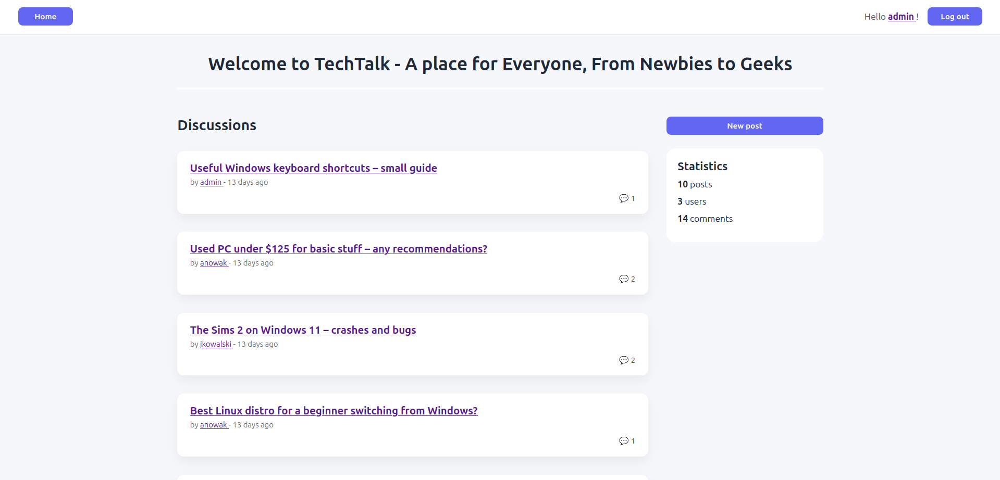
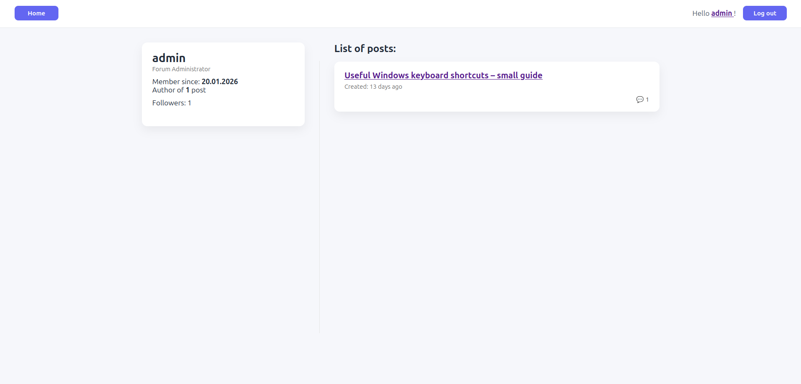

# TechTalk Forum – Ruby on Rails Application

A simple and modern discussion forum built with **Ruby on Rails**.  
The application allows users to create posts, comment on discussions, follow other users and manage content based on permissions.

The project was created as a learning and portfolio project.

---

## Requirements

- Rails 8.1.2
- Ruby 3.2.3

## Features

- User authentication (login / logout)
- Create, edit and delete posts
- Add comments to posts
- Edit and delete own comments
- Admin privileges (edit/delete any content)
- Image upload for posts
- Rich text editor for posts and comments
- View user profiles with detailed information
- Follow and unfollow other users
- Responsive and clean UI design

---

## Update (05.02.2026)

- Added user profile page to view detailed information about a user and see the list of posts they have created
- Added functionality to follow and unfollow other users

## Screenshots

### Homepage – Posts List

### Homepage v2 - Posts List with links to User Profile

### Single Post with Comments

### Create / Edit Post Form

### Login Page

### User Profile Page

.png)
.png)