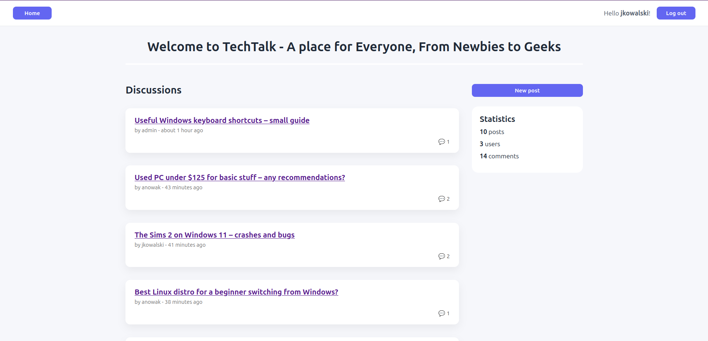
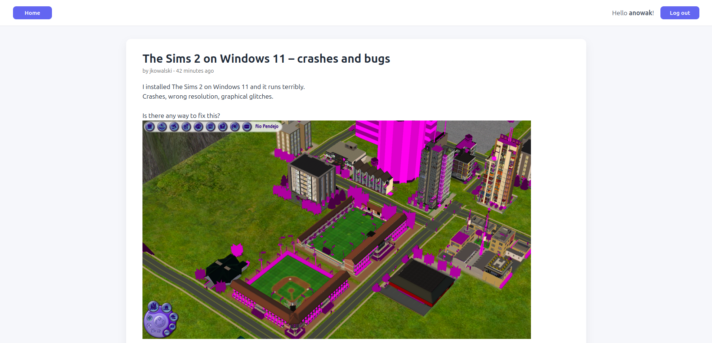
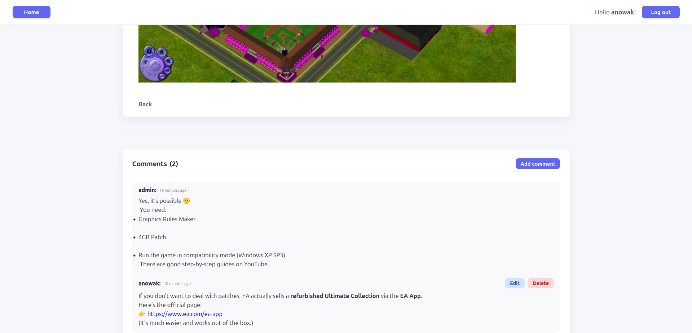
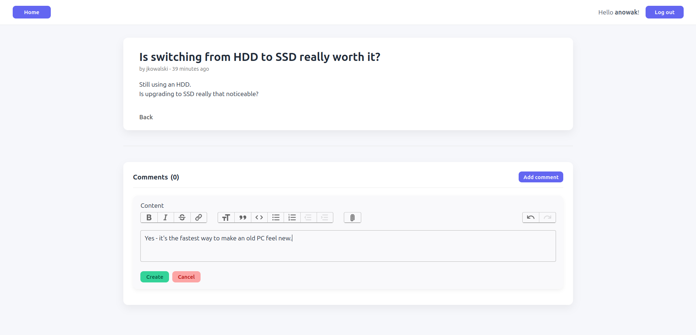
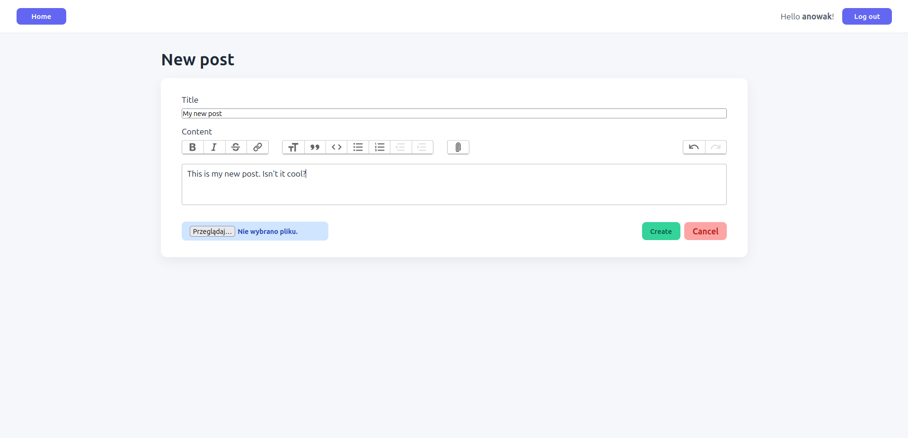

# Tech Forum – Ruby on Rails Application

A simple and modern discussion forum built with **Ruby on Rails**.  
The application allows users to create posts, comment on discussions, and manage content based on permissions.

The project was created as a learning and portfolio project.

---

## Features

- User authentication (login / logout)
- Create, edit and delete posts
- Add comments to posts
- Edit and delete own comments
- Admin privileges (edit/delete any content)
- Image upload for posts
- Rich text editor for posts and comments
- Responsive and clean UI design

---

## 🖼 Screenshots

### Homepage – Posts List

### Single Post with Comments

### Create / Edit Post Form

### Login Page

